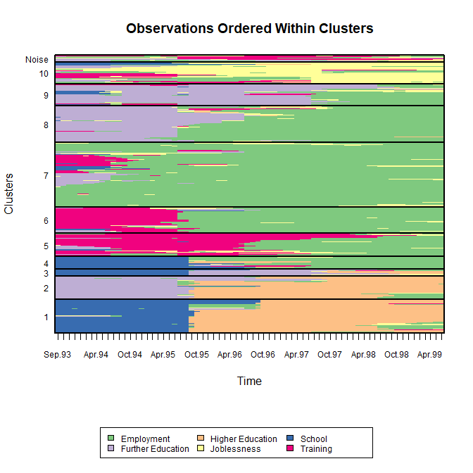
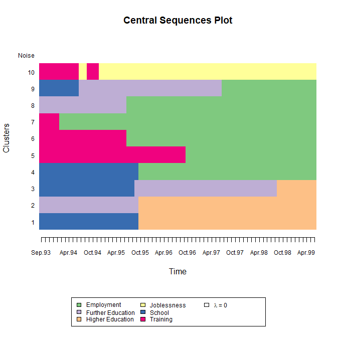
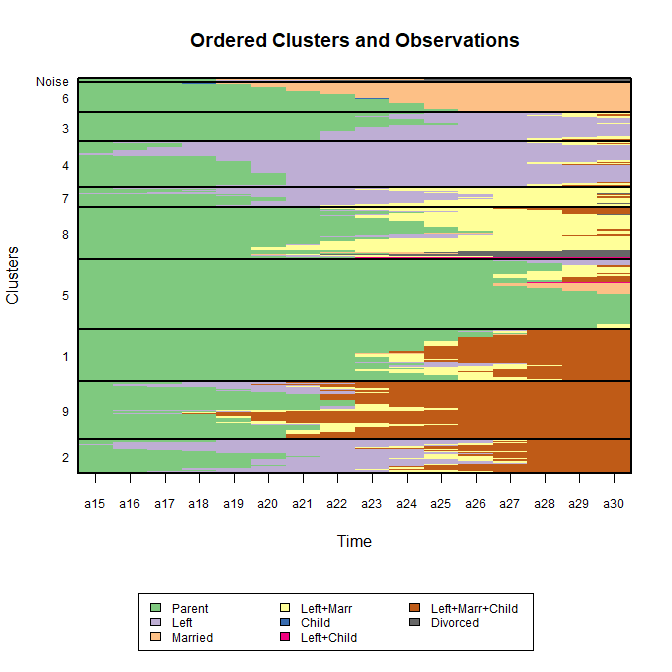

```{r setup, include=FALSE}
knitr::opts_chunk$set(fig.width=7, fig.height=7, fig.align = 'center', fig.show='hold',
                      dev.args=list(type="cairo"), warning=FALSE, message=FALSE, 
                      progress=FALSE, collapse=TRUE, comments="#>")
```

## Introduction
__MEDseq__ is an R package which fits a range of models introduced by [Murphy et al. (2019)](https://arxiv.org/abs/1908.07963). These are finite mixtures of exponential-distance models for clustering longitudinal/categorical life-course sequence data. A family of parsimonious precision parameter constraints are accommodated. So too are sampling weights. Gating covariates can be supplied via formula interfaces. Visualisation of the results of such models is also facilitated.

The most important function in the __MEDseq__ package is: `MEDseq_fit`, for fitting the models via the EM or CEM algorithms. `MEDseq_control` allows supplying additional arguments which govern, among other things, controls on the initialisation of the allocations for the EM/CEM algorithm and the various model selection options. `MEDseq_compare` is provided for conducting model selection between different results from using different covariate combinations &/or initialisation strategies, etc. `MEDseq_stderr` is provided for computing the standard errors of the coefficients for the covariates in the gating network.

A dedicated plotting function exists for visualising various aspects of the results, using new methods as well as some existing methods from the __TraMineR__ package. Finally, the package also contains two data sets: `biofam` and `mvad`.

If you find bugs or want to suggest new features please visit the __MEDseq__ [GitHub issues page](https://github.com/Keefe-Murphy/MEDseq/issues). 

This vignette mostly aims to demonstrate the __MEDseq__ models by reproducing the analysis of the MVAD data in the Murphy et al. (2019) paper. However, an additional example data set is also analysed.

### Installing MEDseq
__MEDseq__ will run in Windows, Mac OS X, or Linux. To install it you first need to install [R](https://cran.r-project.org/). Installing [Rstudio](https://www.rstudio.com/) as a nice desktop environment for using R is also recommended.

Once in R you can type at the R command prompt:

```{r, eval=FALSE}
install.packages('devtools')
devtools::install_github('Keefe-Murphy/MEDseq')
```

to install the latest development version of the package from the __MEDseq__ [GitHub page](https://github.com/Keefe-Murphy/MEDseq). To instead install the latest stable official release of the package from CRAN go to R and type:

```{r, eval=FALSE}
install.packages('MEDseq')
```

In either case, if you then type:

```{r}
library(MEDseq)
```

it will load in all the __MEDseq__ functions.

The GitHub version contains a few more features but some of these may not yet be fully tested, and occasionally this version might be liable to break when it is in the process of being updated.

```{r, echo=FALSE}
suppressMessages(library(TraMineR))
```

## MVAD Data
Load the MVAD data. The data comes from a study by McVicar and Anyadike-Danes (2002) on transition from school to work. The data consist of static background characteristics (covariates and sampling weights) and a time series sequence of 72 monthly labour market activities for each of 712 individuals in a cohort survey. The individuals were followed up from July 1993 to June 1999. Type `?mvad` for more information. We will drop the first two sequence positions (i.e. months) as they (along with the covariates `Grammar` and `Location`) were used to define the sampling weights.

Note that the data set must have equal sequence lengths, intervals must be evenly spaced, and missingness is not allowed. The MVAD data meet these criteria. The __TraMineR__ function `seqdef` is used to convert the data to the appropriate format. 

```{r}
data(mvad, package="MEDseq")
mvad$Location <- factor(apply(mvad[,5L:9L], 1L, function(x) which(x == "yes")), 
                        labels = colnames(mvad[,5L:9L]))
mvad          <- list(covariates = mvad[c(3L:4L,10L:14L,87L)], 
                      sequences = mvad[,15L:86L],
                      weights = mvad[,2L])
mvad.cov      <- mvad$covariates
mvad.seq      <- seqdef(mvad$sequences[-c(1L,2L)],
                        states = c("EM", "FE", "HE", "JL", "SC", "TR"),
                        labels = c("Employment", "Further Education", "Higher Education", 
                                   "Joblessness", "School", "Training"))
```

The names of the model types are CC, UC, CU, UU, CCN, UCN, CUN, and UUN. The first letter denotes whether the precision parameters are constrained (C) or unconstrained (U) across clusters, the second denotes the same across time periods, and the third letter (N) indicates the precision of a noise component, i.e. one in which the distribution of the sequences is uniform.  

The `MEDseq_control` function allows the algorithm used for model fitting, the method used to initialise the allocations (e.g. k-medoids or Ward's hierarchical clustering), the criterion used to identify the optimal model (e.g. BIC, density-based silhouette (DBS), average silhouette width (ASW), etc.), and more to be specified. By default, the EM algorithm is employed, k-medoids is used to obtain starting values, and the BIC is used to choose the optimal model (if a range of models are fitted). In this vignette, we will mostly accept these defaults, with the exception of the `noise.gate` argument.

The optimal model identified in the Murphy et al. (2019) paper has `G=11` components, the `UUN` model type, sampling weights, and one covariate (an indicator of GCSE exam performance) in the gating network, identified using a stepwise variable selection procedure. The UUN model has a specific precision parameter for each time point in each cluster. The `gating` covariates can be specified via a formula interface. The argument `covars` tells the formula where to look for the specified covariates. Here, the probability of belonging to this noise component is set to be independent of the included gating covariate. Thus, to fit such a model:

```{r, eval=FALSE}
mod1 <- MEDseq_fit(mvad.seq, G=11, modtype="UUN", weights=mvad$weights, gating=~ gcse5eq, 
                   covars=mvad.cov, control=MEDseq_control(noise.gate=FALSE))
```

Typically, a range of `G` values and `modtype` settings are supplied to a single call to `MEDseq_fit` and chosen from using some criterion. Thus, for a given set of covariates, the model which is optimal in terms of the number of components and the precision parameter configuration can be identified. 

To compare different runs using different sets of covariates, the function `MEDseq_compare` can be used. First, let's fit models with all covariates included (except `Grammar` and `Location`) and no covariates included. Let's try different numbers of components and different model types. Note that only the first model here includes a noise component.

```{r, eval=FALSE}
# 10-component CUN model with no covariates.
# CUN models have a precision parameter for each sequence position (i.e. time point),
# though each time point's precision is common across clusters.

mod2 <- MEDseq_fit(mvad.seq, G=10, modtype="CUN", weights=mvad$weights)

# 12-component CC model with all covariates.
# CC models have a single precision parameter across all clusters and time points.

mod3 <- MEDseq_fit(mvad.seq, G=12, modtype="CC", weights=mvad$weights,
                   gating=~. - Grammar - Location, covars=mvad.cov)
```

Confirm that the first model is indeed optimal according to the BIC. Examine the optimal model in greater detail. 

```{r, include=FALSE}
load(file="mvad_mod1.rda")
load(file="mvad_mod2.rda")
load(file="mvad_mod3.rda")
```

```{r}
(comp <- MEDseq_compare(mod1, mod2, mod3, criterion="bic"))
```

```{r}
opt   <- comp$optimal
summary(opt, classification = TRUE, parameters = FALSE, network = FALSE)
```

Examine the estimated gating network coefficients with the dedicated `print` method. Note that standard errors can be computed by calling `MEDseq_stderr` on the `opt` object, to better inform the interpretations of the covariate effects.

```{r}
print(opt$gating)
```

Visualise the clusters uncovered by the optimal model. Note that seriation is applied (by default) to the observations within clusters for visual clarity. The legend indicates which colours correspond to which state categories. 

```{r, eval=FALSE}
plot(opt, type="clusters")
```

```{r, echo=FALSE}

```

Many other plotting options exist, some of which are adapted from the __TraMineR__ package. Use the following code to examine the central sequence parameters. Note that the central sequence of the noise component is not shown as it doesn't contribute to the likelihood.

```{r, eval=FALSE}
plot(opt, type="mean")
```

```{r, echo=FALSE}

```

Use the following code to see the observation-specific (weighted) density-based silhouette values (coloured by cluster). The (weighted) mean within each cluster is also shown. Note that the low average for the noise component is as expected; we do not expect this cluster to be internally coherent, rather it acts as a filter that allows the other clusters to be captured more clearly.

```{r, fig.height=8.5}
plot(opt, type="dbsvals")
```

Finally, we can quantify the type of observation characterising each cluster by computing the mean time spent in each state within each cluster. By specifying `MAP=TRUE` here, we are computing the mean time based on the hard MAP partition rather than weighted by the soft cluster membership probabilities (albeit still weighted by the sampling weights used during model fitting, by default). By specifying `norm=TRUE` (which is the default), the mean times are normalised to sum to the sequence length within each cluster. The size of each cluster in terms of the number of observations assigned to it is also reported.

```{r}
MEDseq_meantime(opt, MAP=TRUE, norm=TRUE)
```

## Biofam Data
As a second example, let's consider data on $N=2000$ 16 year-long family life state sequences built from the retrospective biographical survey carried out by the Swiss Household Panel (SHP) in 2002. Each of the $v=8$ states are defined from a combination of five basic states; namely, living with parents (Parent), left home (Left), married (Marr), having children (Child), and Divorced. The data is available in the __MEDseq__ package as `biofam`. Type `?biofam` for more information. 

```{r}
data(biofam, package="MEDseq")
biofam     <- list(covariates = biofam[2L:9L], 
                   sequences = biofam[10L:25L] + 1L)
biofam.cov <- biofam$covariates[,colSums(is.na(biofam$covariates)) == 0]
biofam.seq <- seqdef(biofam$sequences,
                     states = c("P", "L", "M", "L+M", 
                                "C", "L+C", "L+M+C", "D"),
                     labels = c("Parent", "Left", "Married", 
                                "Left+Marr", "Child", "Left+Child", 
                                "Left+Marr+Child", "Divorced"))
```

While the data set contains weights, they are not appropriate for use; `biofam` is merely a subsample of the original data so the weights are not properly adapted. Thus, we will fit a model without supplying the `weights` argument. Secondly, the data set also contain some baseline covariates. As many of them contain missing values, let's only consider the `birthwt` variable, which gives the birth year of each subject. Again, we override the `noise.gate=TRUE` default so that the covariate(s) do not influence the mixing proportions of the noise component. We do so here directly, without invoking `MEDseq_control` explicitly. Thus, the noise component's mixing proportion will be constant (though estimated) across all observed sequences and covariate patterns.


```{r, eval=FALSE}
# The UUN model includes a noise component.
# Otherwise, the model has a precision parameter for each time point in each cluster.

bio <- MEDseq_fit(biofam.seq, G=10, modtype="UUN", gating=~ birthyr, 
                  covars=biofam.cov, noise.gate=FALSE)
```

```{r, echo=FALSE}
bio <- MEDseq_fit(biofam.seq, G=10, modtype="UUN", gating=~ birthyr, 
                  covars=biofam.cov, noise.gate=FALSE, verbose=FALSE)
```

Such a model was identified as optimal following the same steps as the analysis of the MVAD data in the Murphy et al. (2019) paper, albeit according to the weighted DBS criterion rather than the BIC. Print the details of the model to the screen:

```{r, echo=FALSE}
bio$call <- bio$call[-length(bio$call)]
```

```{r}
print(bio)
```

As before, let's look at the clusters uncovered by the model. This time, `seriate="both"` means to order the clusters themselves as well as the observations within clusters for visual clarity.

```{r, eval=FALSE}
plot(bio, type="clusters", seriate="both")
```

```{r, echo=FALSE}

```

Use the following code to examine the precision parameters. Note how we have a full $16\times G$ matrix of precision parameters, one for each time point in each cluster. In this case there are many quite large precision parameter values which skew the colour scale. Indeed, some are even infinite! Infinite precision under UU or UUN models implies that all values for that time point are identical to the corresponding central sequence position estimate of the given cluster. By specifying `quant.scale=TRUE`, quantiles are used to construct non-linear break-points, thereby ensuring each colour represents an equal proportion of the data. We invoke `seriate` again for comparability.

```{r}
plot(bio, type="precision", quant.scale=TRUE, seriate="clusters")
```

This time, rather than showing the weighted mean DBS values, let's look at observation-specific (unweighted) average silhouette-width values. Note that this relies instead on the MAP partition rather than the soft cluster assignment probabilities.

```{r, fig.height=8.5}
plot(bio, type="aswvals")
```

As stated above, some plot types are adapted from __TraMineR__. Let's first look at a plot of the transversal Shannon entropies for the whole data set.

```{r}
seqHtplot(biofam.seq)
```

Now let's use the plot function from __MEDseq__ to examine the transversal entropies within each cluster defined by the MAP partition. Here we can see for instance that subjects assigned to Cluster 9, corresponding to those individuals who left the parental home to marry relatively early and had a child on average just one year later, do indeed exhibit greater variability. Conversely, a postponement of the transition to adulthood is evident for subjects in Cluster 5.

```{r, fig.height=8.5}
plot(bio, type="Ht")
```

Other plot types adapted from __TraMineR__ can be produced using `type="d"` (state distribution plots), `type="f"` (state frequency plots), `type="i"` (selected sequence index plots), and `type="I"` (whole set index plots). Each of these plots are shown on a per-cluster basis. Clustering uncertainties, the gating network, and model selection criteria can also be visualised. 

---------

## References
Murphy, K., Murphy, T. B., Piccarreta, R., & Gormley I. C. (2019). Clustering longitudinal life-course sequences using mixtures of exponential-distance models. _To appear_. Pre-print available at [arXiv:1908.07963](https://arxiv.org/abs/1908.07963).

McVicar, D. and Anyadike-Danes, M. (2002). Predicting successful and unsuccessful transitions from school to work by using sequence methods. _Journal of the Royal Statistical Society: Series A (Statistics in Society)_, 165(2): 317-334.

Müller, N. S., Studer, M., and Ritschard, G. (2007). Classification de parcours de vie à l'aide de l'optimal matching. In _XIVe Rencontre de la Société francophone de classification (SFC 2007), Paris, 5-7 septembre 2007_, pp. 157-160.

Gabadinho, A., Ritschard, G., Müller, N. S., and Studer, M. (2011). Analyzing and visualizing state sequences in R with TraMineR. _Journal of Statistical Software_, 40(4): 1-37.